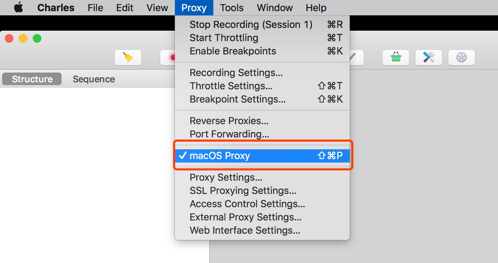
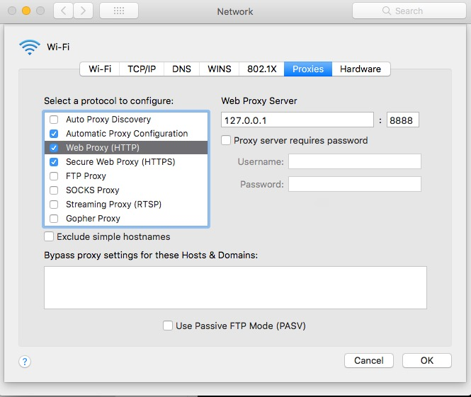
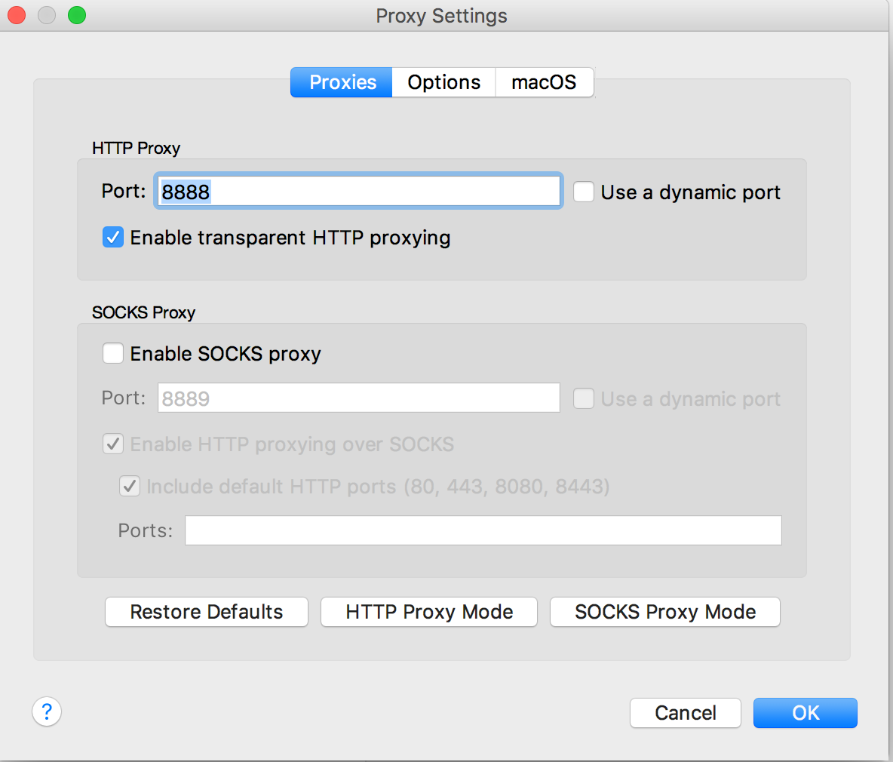
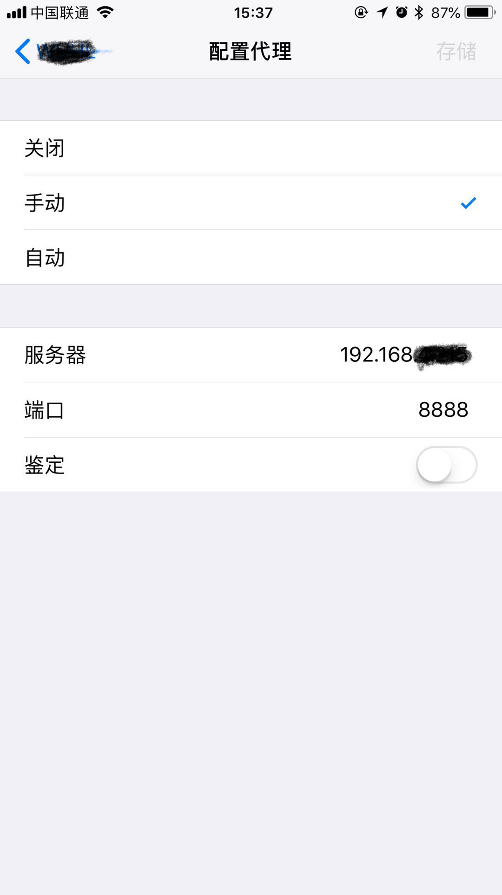
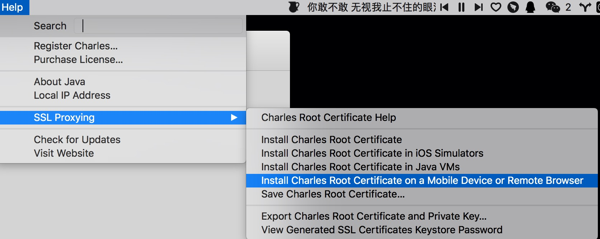
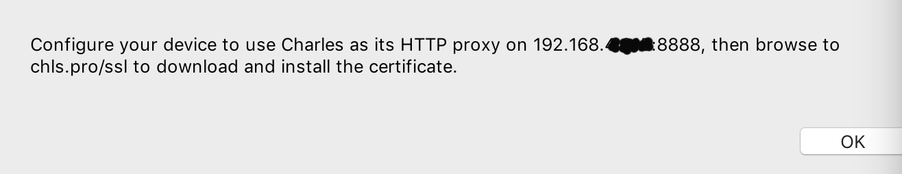
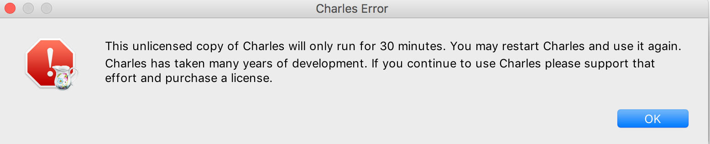

# Charles 代理教程

## 安装
https://www.charlesproxy.com/download/

## 设置为系统代理
### 设置成系统代理(前面钩子勾上就可以了)
- 
### System Preferences -> Network -> 当前网络的 Advanced -> Proxies
### 系统的 HTTP 请求代理到了 127.0.0.1:8888
- 
### 这里的配置要和 Proxy -> Proxy Setting 里面设置的端口保持一致
- 
### 测试
```
curl http://example.com --proxy 127.0.0.1:8888
```

---

## 代理手机的网络请求
### 手机和电脑存在同一个局域网，即连接同一个 Wi-Fi
### 获取电脑的 IP 地址
```
ifconfig en0
```
### 把 Wi-Fi 的设置成 PC 的系统代理
- 

### 电脑会出现一个弹层，点击 Allow，表示允许手机代理到电脑上

### 下载手机证书
- 

会弹出一个窗口，类似这样子：

- 
然后手机上 Safari 直接输入地址，点击允许配置描述文件，就会安装证书了

### 然后设置 -> 通用 -> 关于本机 -> 证书信任设置 把 Charles Proxy 设置成信任就可以了

---

## 电脑抓包
- Proxy -> SSL Proxying Setting -> add *:443
- Help -> SSL Proxying -> install Charies Root Certificate
- 把当前的代理成和系统的 HTTP 请求代理一样就可以了


---
#### 温馨提醒：
- 软件为付费产品，不购买的话会出现以下弹层
- 
